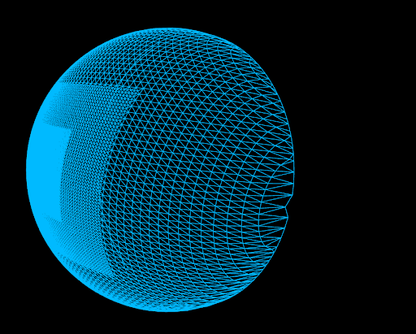
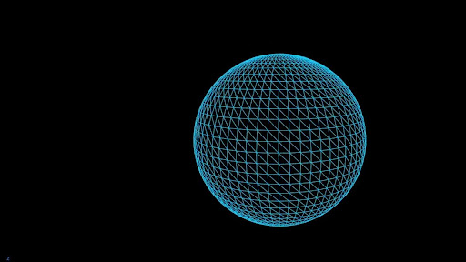

# Clipmap

Gestiona la malla del planeta y el sistema de LOD (Level of Detail) mediante anillos concéntricos. Se trata de una semiesfera formada por distintas capas de malla que sigue al viewport de la cámara.

Al alejarte lo suficiente del planeta, la semiesfera no requiere tanta resolución para notar el detalle por lo que se convierte en una malla estática de una esfera. Combinando que al acercarse la semiesfera siempre sigue a la cámara y que al alejarse se ve una malla esférica, siempre tiene apariencia de planeta y se mejora mucho el rendimiento con esta técnica.

* **Base Resolution:** Densidad de triángulos en la malla (debe ser múltiplo de 4). A mayor resolución, más detalle en el planeta pero más costo de rendimiento. Si la ejecución muestra rendimiento pobre se puede bajar este parámetro para mejorarlo.
* **Num Levels:** Número de anillos cuadriculares que sirven como niveles de detalle que componen el planeta. Este parámetro también afectará directamente al rendimiento, ya que cada anillo concéntrico interior tiene el doble de resolución que su adyacente exterior.
* **Min Triangle Size:** Tamaño mínimo del triángulo antes de subdividir al siguiente nivel de detalle.
* **Height Visibility:** Altitud a la cual se simplifican los anillos a un nivel de detalle único.
