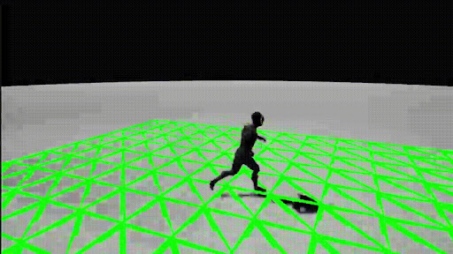

## Collision Component
Este componente hereda de la interfaz `IInterface_CollisionDataProvider`, permitiendo definir manualmente la geometría de colisión utilizada por el motor físico. Se genera una rejilla bidimensional donde cada punto se proyecta sobre la superficie de una esfera de radio determinado. Esta rejilla sigue continuamente al jugador, de forma que el cálculo de colisiones se hace en una zona cercana. Se puede configurar el tamaño de la zona.

**Parámetros:**
* **Collision Triangle Size:** Tamaño de los triángulos que forman la malla de colisión
* **Collision Resolution:** Resolución de la rejilla que forma la malla de colisión
* **Show Collision Mesh:** Permite depurar la zona en la que se realiza el cálculo de colisiones. Se puede cambiar el color y la anchura del dibujado con Debug Color y Debug Line Width.

