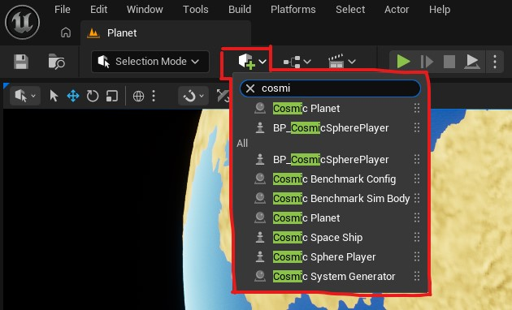
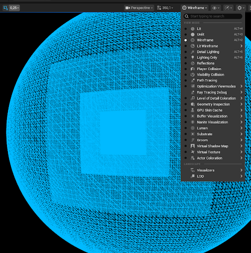
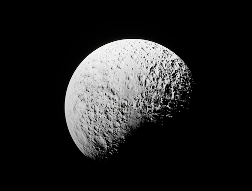
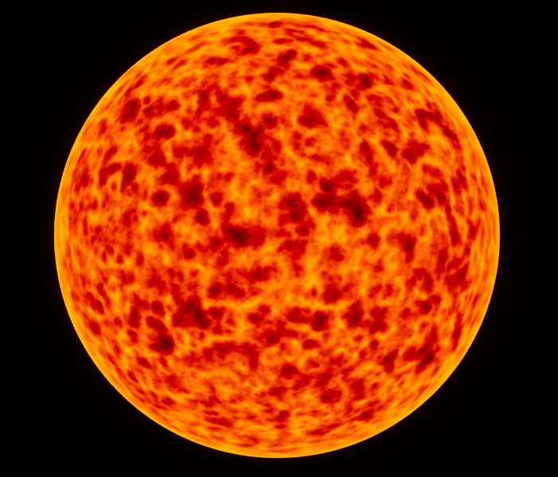
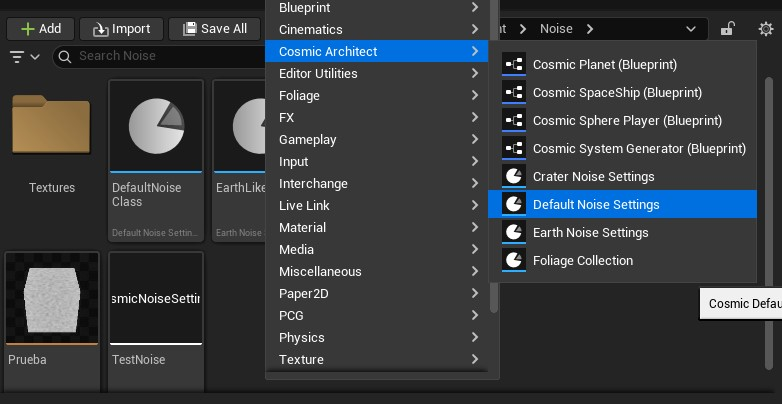
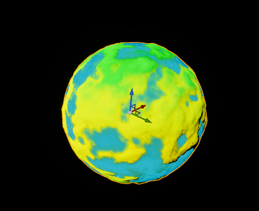
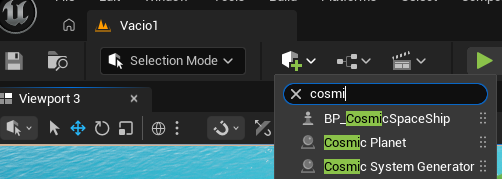
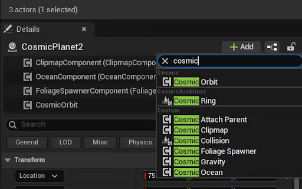
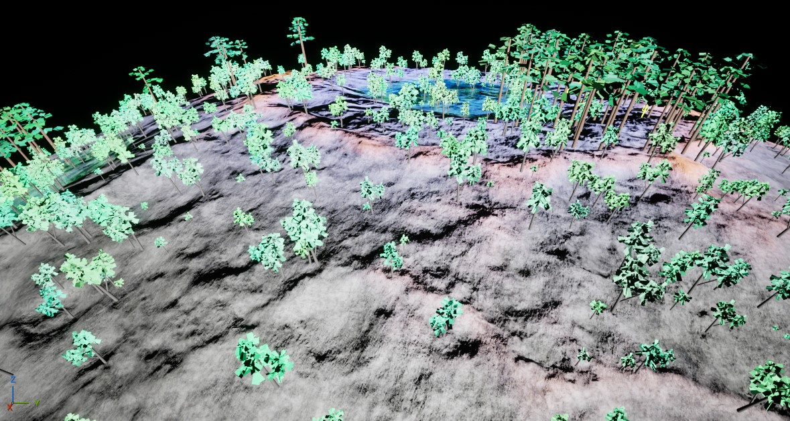
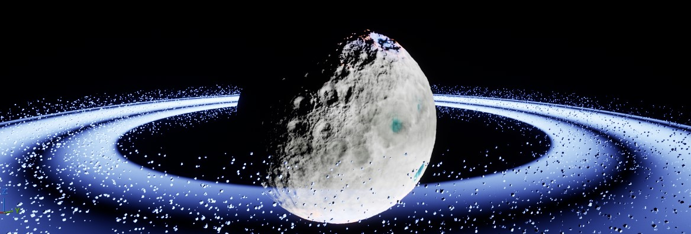

# Crea tu primer Planeta

En nuestro canal de YT se puede ver este tutorial (sin comentarios), pero recomendamos seguir los pasos de la web, para entender mejor el proceso.

[https://www.youtube.com/@CosmicArchitect-w2n](https://www.youtube.com/@CosmicArchitect-w2n)&#x20;

### 1. Cosmic Planet

* Crea un nuevo Level e instancia una luz direccional si no tiene
* Añade el objeto Cosmic Planet a tu escena buscando en la lupa

<figure><figcaption></figcaption></figure>

* A continuación selecciona el planeta (doble click en Outliner)

### 2. Clipmap

Activa el modo wireframe para ver cómo funciona el clipmap.

 Cada cuadrado es un nivel de detalle (LOD, Level Of Detail). Cuando te mueves, la estructura te sigue para que las zonas más alejadas se rendericen con menos vértices. En el `ClipmapComponent` del objeto puedes configurar:

* La resolución base de la malla, valor recomendado `128`  (Base Resolution)
* El número de niveles que se crean (Num Levels)
* El tamaño mínimo de cada triángulo al acercarse (Min Triangle Size)
* La distancia a la que el clipmap se deja de ver (Height Visibility). Si te alejas mucho del planeta la malla se convierte en estática para ahorrar rendimiento, y este último parámetro define esa distancia.

### 3. Material

Vuelve a poner el modo Lit, y busca el apartado Materials del planeta. Selecciona la pestaña de None del Base Material y busca en la lupa `Cosmic Moon Material`. Puedes cambiar los colores del planeta en el apartado Color a tonos grisáceos para imitar los de una luna. También tienes la opción de ponerle un material de gigante de gas (Cosmic Gas Giant) o del sol (Cosmic Sun).

  

### 4. Ruido

Antes de continuar deja puesto el material CosmicMoon o Cosmic Earth. Verás un apartado en Planet llamado Noise que contiene Noise Class, con esto configuraremos la forma del terreno. En una carpeta de tu proyecto del Content Browser haz click derecho, `Cosmic Architect` -> `Default Noise Settings`

 

Llámalo `NoisePlanet`. Ahora arrástralo al atributo Noise Class de tu planeta. Ahora configuremos tus Noise Settings, doble click y en la pestaña Layer Parameters cambia los parámetros:

* **Frequency:** entre 2 y 5. Esto definirá la frecuencia de regiones altas en tu mundo.
* **Amplitude:** 5.000 y 10.000. Esto definirá la altura máxima a la que llegarán esas regiones.

Con esto ya tienes el ruido biológico de un planeta sencillo. Tambíén se pueden configurar los biomas ajustando los BiomeParameters, estos tendrán efectos directos en como se ve el planeta y también en la distribución de la vegetación. Puedes cambiar los parámetros a tu gusto, o poner por ejemplo el ruido ya configurado Calisto\_Noise.&#x20;

### 5. Océano

Agrega un océano a tu planeta, debes marcar la casilla "Has Ocean" del CosmicPlanet si no lo estaba y cambiar el nivel del mar con "Sea Level Km", puedes mover dinámicamente el valor para ver el resultado. En el OceanComponent asigna el Ocean Material, busca Cosmic Ocean. Si te acercas al mar podrás ver el movimiento de las olas.

 

### 6. Gravedad

Es hora de añadir gravedad a tu planeta, en los detalles de tu Cosmic Planet dale a Add y busca `Cosmic Gravity`.

A continuación, selecciónalo y configúralo como en la siguiente imagen: _(Ajustando Gravity Mode, Radius Km, Surface Gravity, Affects Others, e Is Planet)_.

### 7. Nave espacial

Toca aterrizar en el planeta. Para ello añade a la escena `BP_CosmicSpaceShip` , si no te aparece ese nombre exacto puedes navegar a la carpeta del plugin desde el Content Browser  `Engine` -> `Plugins` -> `CosmicArchictect` -> `Blueprints`->`Ships` y arrastrarlo directamente a la escena. Coloca la nave cerca del planeta.

Ahora dale al botón de play e intenta aterrizar o dar alguna vuelta, usa WASD para moverte, QE para rotar, Ctrl - Space para subir y bajar y el ratón para girar moviendo la cámara.

### 8. Órbita

Duplica tu planeta (seleccionalo y pulsa Ctrl + D), y añadele un componente Cosmic Orbit.&#x20;

<figure><figcaption></figcaption></figure>

Asigna en el componente el planeta al que orbitará en el apartado ParentBody y aumenta el valor Semi Major Axis Km para aumentar el tamaño de la órbita. Si le das a play verás que ese planeta orbita alrededor del otro.

### 9. Vegetación

En el FoliageSpawnerComponent del planeta, asigna al Foliage Collection `BigPlanetFoliage`, una estructura de datos con mallas y parámetros de generación del follaje. Si te acercas al planeta podrás ver plantas y rocas aparecer.

<figure><figcaption></figcaption></figure>

### 10. Anillos

Puedes añadir anillos a tu planeta añadiendo el componente Cosmic Ring, y configurar el Inner Radius y Outer Radius para definir su rango, además del número de sectores visibles de asteroides y su tamaño.

<figure><figcaption></figcaption></figure>
