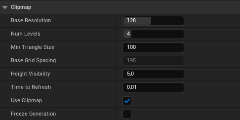
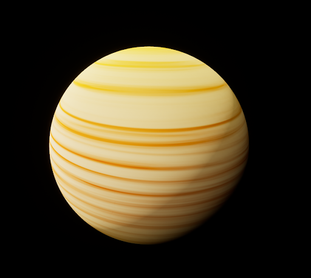
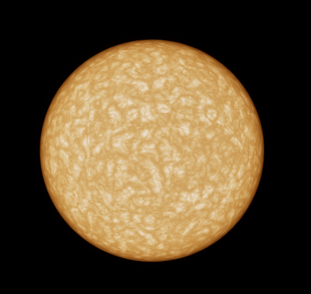
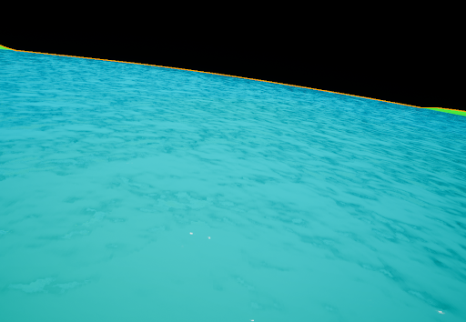
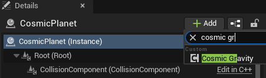
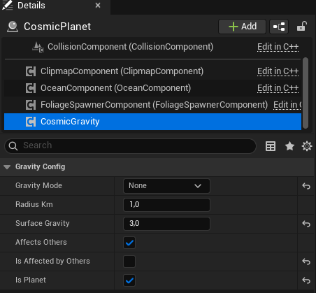
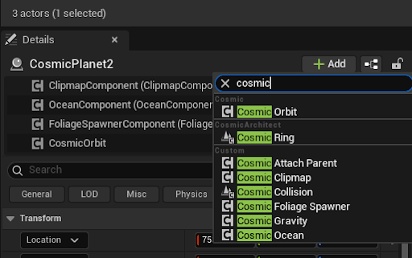
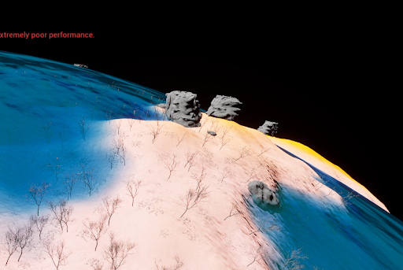
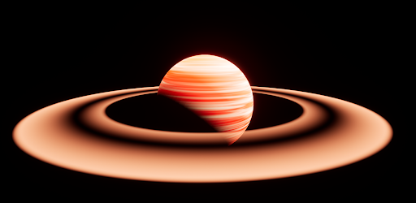

# Get Started - Crea tu primer planeta

### 1. Cosmic Planet
* Crea un nuevo Level e instancia una luz direccional si no tiene
* Añade el objeto Cosmic Planet a tu escena
* A continuación selecciona el planeta (doble click en Outliner)

### 2. Clipmap
Activa el modo wireframe para ver cómo funciona el clipmap.

Cada cuadrado es un nivel de detalle (LOD, Level Of Detail). Cuando te mueves, la estructura te sigue para que las zonas más alejadas se rendericen con menos vértices. En el `ClipmapComponent` del objeto puedes configurar:
* La resolución base de la malla (Base Resolution)
* El número de LODs que se crean (Num Levels)
* El tamaño mínimo de cada triángulo (Min Triangle Size)
* El tiempo que tarda en refrescar el clipmap (Time To Refresh)
* La distancia a la que el clipmap se deja de ver (Height Visibility). Si te alejas mucho del planeta la malla se convierte en estática para ahorrar rendimiento, y este último parámetro define esa distancia.

### 3. Material
Vuelve a poner el modo Lit, y busca el apartado Materials del planeta. Selecciona la pestaña de None del Base Material y busca en la lupa `Cosmic Moon Material`. Puedes cambiar los colores del planeta en el apartado Color a tonos grisáceos para imitar los de una luna. También tienes la opción de ponerle un material de gigante de gas (Cosmic Gas Giant) o del sol (Cosmic Sun).

### 4. Ruido
Antes de continuar deja puesto el material CosmicMoon o Cosmic Earth. Verás un apartado en Planet llamado Noise que contiene Noise Class, con esto configuraremos la forma del terreno. En una carpeta de tu proyecto del Content Browser haz click derecho, `Cosmic Architect` -> `Default Noise Settings..`. Llámalo `NoisePlanet`. Ahora arrástralo al atributo Noise Class de tu planeta. Ahora configuremos tus Noise Settings, doble click y en la pestaña Layer Parameters cambia los parámetros:
* **Frequency:** entre 2 y 5. Esto definirá la frecuencia de regiones altas en tu mundo.
* **Amplitude:** 5.000 y 10.000. Esto definirá la altura máxima a la que llegarán esas regiones.

Con esto ya tienes el ruido biológico de un planeta sencillo. Puedes cambiar los parámetros a tu gusto.

### 5. Océano
Agrega un océano a tu planeta, debes marcar la casilla "Has Ocean" del CosmicPlanet y cambiar el nivel del mar con "Sea Level Km", con 0.001 debería ser suficiente. En el OceanComponent asigna el Ocean Material, busca Cosmic Ocean. Si te acercas al mar podrás ver el movimiento de las olas.

### 6. Gravedad
Es hora de añadir gravedad a tu planeta, en los detalles de tu Cosmic Planet dale a Add y busca `Cosmic Gravity`.

A continuación, selecciónalo y configúralo como en la siguiente imagen: *(Ajustando Gravity Mode, Radius Km, Surface Gravity, Affects Others, e Is Planet)*.

### 7. Nave espacial
Toca aterrizar en el planeta. Para ello añade a la escena `BP_CosmicSpaceShip` y coloca la nave cerca del planeta.

Ahora dale al botón de play e intenta aterrizar o dar alguna vuelta, usa WASD para moverte, QE para rotar, Ctrl - Space para subir y bajar y el ratón para girar moviendo la cámara.

### 8. Órbita
Duplica tu planeta, y añadele al otro un componente Cosmic Orbit. Asigna el el componente el planeta al que orbitará y aumenta el Semi Major Axis Km. Si le das a play verás que ese planeta orbita alrededor del otro. También puedes aumentar el parámetro Spin Speed para hacer que el planeta rote sobre sí mismo.

### 9. Vegetación
En el FoliageSpawnerComponent, asigna al Foliage Collection `Earth Foliage`, una estructura de datos con mallas y parámetros de generación del follaje. Si te acercas al planeta podrás ver plantas y rocas aparecer.

### 10. Anillos
Puedes añadir anillos a tu planeta añadiendo el componente Cosmic Ring, y cambiando el material del componente a `M_CosmicRing`.

