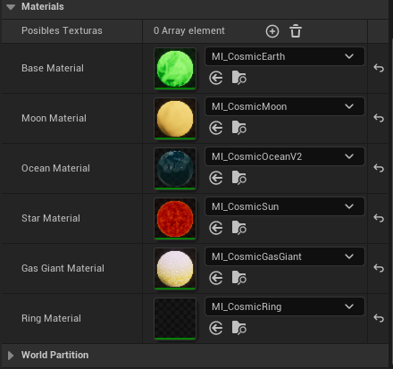
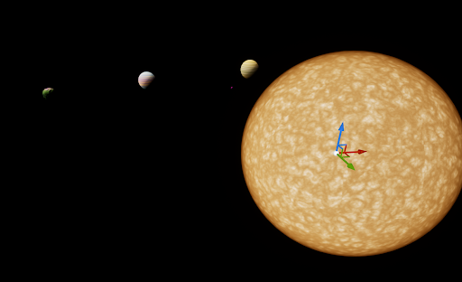

# Crea tu primer sistema planetario

* Elimina todos los objetos, incluido el Directional Light
* Añade un objeto de tipo `Cosmic System Generator` a tu escena.
* En el apartado Materials, asigna los materiales a cada tipo de objeto (Busca Cosmic y aparecerán los materiales que necesitas)

* En la pestaña de detalles, busca el botón de `GenerateBodies` y púlsalo. Se generará un sistema planetario con cuerpos celestes de distintos tipos.
* Para eliminar los planetas, basta con pulsar `ClearBodies`, y para crear otro sistema planetario con otra disposición, basta con pulsar `GenerateWithRandom Seed`.
* Si pulsas play, verás como los planetas orbitan alrededor de la estrella, y los planetas a su vez tienen lunas que orbitan alrededor de ellas
* Para configurar tu sistema planetario, puedes ir a la sección de configuración y modificar los parámetros que quieras. Puedes hacer que el espacio donde se genera el sistema sea mayor, que se generen más planetas, que sean más grandes y que la distancia mínima y máxima entre los planetas sean distintas.

