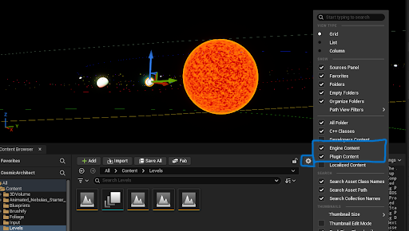

# Cosmic Architect Plugin

Este plugin permite generar planetas procedimentalmente con sistemas de ruido avanzados, LOD dinámico y soporte para colisiones. Además proporciona un sistema de interacciones gravitatorias y órbitas customizables.

### Características
* Generación procedimental de planetas y sistemas planetarios
* Compatible con Unreal Engine [5.7]
* Extensible
* Optimizado para rendimiento

# Instalación

1. Copia a carpeta `5.7/Engine/Plugins/Marketplace` o a carpeta `Plugins` de tu proyecto
2. Activa el plugin en: `Edit` -> `Plugins` -> `Cosmic Architect`
3. Activa el contenido de plugin y motor si no lo tienes ya.

