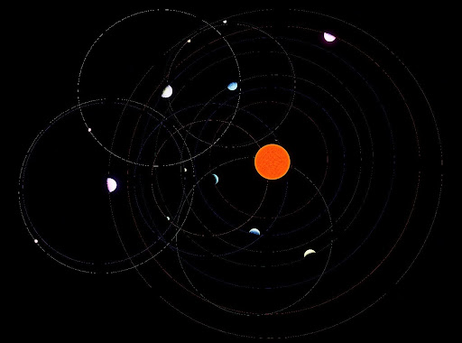

# Cosmic System Generator

Es el actor que permite generar sistemas planetarios. Los sistemas siempre tienen una estrella central con una luz direccional, y los planetas se crean alrededor de ella. Para generarlos se producen parámetros aleatorios dentro de rangos razonables, y en función de los parámetros se clasifican los planetas como gigante de gas, asteroide o planeta telúrico (parecido a la Tierra). Se establecen valores de ruido aleatorios dentro de un rango, y valores como la distancia a la estrella y el radio del planeta también.

Esta es la estructura de datos que se utiliza para clasificar cada planeta (`FPlanetClassification`):

* `EPlanetType Type` (GasGiant, Telluric o AsteroidBelt)
* `bool bHasOcean`
* `float OceanSeaLevel`
* `bool bHasRings`
* `bool bHasMoons`
* `int32 MaxMoons`

**Parámetros que se pueden modificar en el System Generator:**

* **Seed:** Semilla para la generación de números aleatorios (Determinismo).
* **OrbitSpeedMultiplier:** Multiplicador global de velocidad para todos los periodos orbitales del sistema. 1.0 = velocidad normal. Valores mayores aceleran todas las órbitas proporcionalmente.
* **bIsSimulatingOrbits:** Indica si la simulación orbital en el editor está activa. Este valor se modifica con el botón StartOrbitSimulation y StopOrbitSimulation.
* **Debug:** Sección para ver qué área cubre el sistema planetario a generar. Se dibuja una línea que traza la caja que va a contener los planetas al generarlos. Se puede configurar la anchura y color de esta línea.
* **Number of Bodies:** Número de cuerpos celestes que se van a generar.
* **VolumeSizeKm:** Tamaño del volumen en el que se generarán los planetas. El radio de la estrella se calcula a partir de este valor, y también se utiliza para definir el rango aleatorio de valores de distancia que tienen los planetas respecto a la estrella.
* **BodyDiameterRangeKm:** Rango de diámetro aleatorio en Kilómetros (Mín, Máx) para cada cuerpo.
* **MinDistanceBetweenBodies:** Distancia mínima entre cuerpos para evitar solapamientos.
* **MaxDistanceToNearest:** Distancia máxima al vecino más cercano. Si es > 0, fuerza a los cuerpos a agruparse.
* **MaxGenerationAttempts:** Número máximo de intentos para encontrar una posición válida antes de cancelar un cuerpo.

Para los planetas se establece un número aleatorio de satélites (lunas) dentro de un rango, para los gigantes de gas, de 1 a 6, y para los rocosos de 0 a 3. Estos satélites se generan con una órbita alrededor del planeta.

