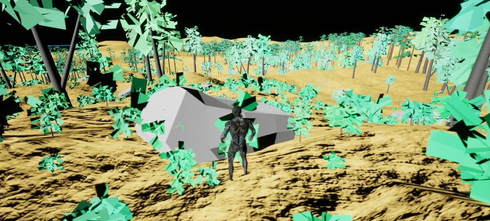

# Escenas demostración

El plugin ofrece 3 escenas ya configuradas para probar ciertos aspectos del plugin.

Para acceder a ellas asegúrate de tener el contenido de plugin y motor visible como se explica en la instalación. A continuación navega en el Content Browser a  `Engine` -> `Plugins` -> `CosmicArchictect` -> `Scenes` .&#x20;

### Planeta

Ahí encontrarás una escena con un planeta ya configurado y un Cosmic Player, dale a play para explorar el planeta.&#x20;

Escena Planet:

<figure><figcaption></figcaption></figure>

### Sistema solar

También encontrarás una escena con el sistema solar en miniatura, puedes hacer en el Outliner doble click en cualquiera de los planetas para visitarlos.

Escena SolarSystem Demo:

<figure><figcaption></figcaption></figure>

### System Generator

Por último encontarás una escena con un CosmicSystemGenerator, en esta puedes iterar rapidamente creando sistemas planetarios con tan solo pulsar un botón. Selecciona el actor CosmicSystemGenerator en el Outliner y busca la sección `Actions` en los detalles.

<figure><figcaption></figcaption></figure>

Para generar un sistema aleatorio puedes pulsar el botón GenerateWithRandomSeed, también puedes ajustar el número de cuerpos que se generan además de otros cuantos parámetros.

Si quieres que el sistema guarde la configuración del ruido de los planetas debes marcar la opción SaveGeneratedNoiseSettings una vez hayas encontrado un sistema que te guste, y hacer clear y generate para que se guarde todo, una vez hecho esto al modificar cualquiera de los ruidos de los planetas, estos se mantendrán al cerrar Unreal. Cabe mencionar que si generas después otro sistema se sobreescribirán.

Además, pulsando el botón StartSimulation y moviendo el slider de Orbit Speed Multiplier podrás cambiar la velocidad dinámicamente de las órbitas.

<figure><figcaption></figcaption></figure>

Escena System Generator:

<figure><figcaption></figcaption></figure>
